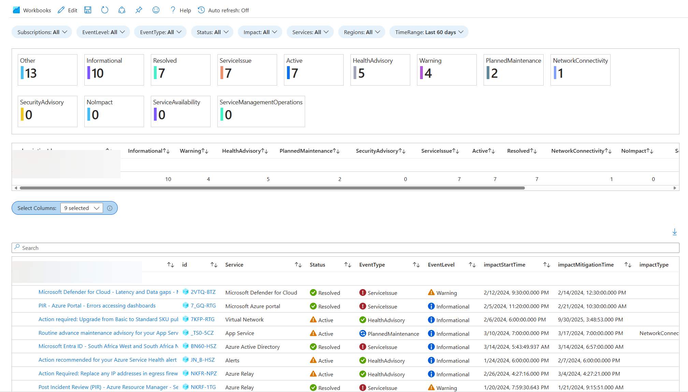

# Azure Service Health Workbook

## Purpose  

To provide filterable reporting of Service Health data. Service Health data is found in Azure Data Explorer. Added example queries to my ARG repo. https://github.com/scautomation/AzureResourceGraph-Examples

## Workbook  

The workbook is fairly simple and provides lots of filtering options.

Selecting Alert title opens the corresponding Azure Portal Blade for that alert

